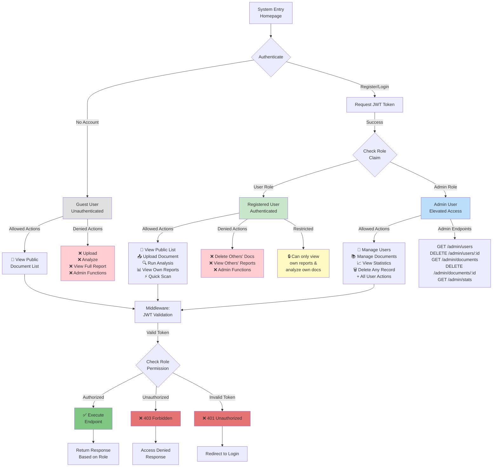
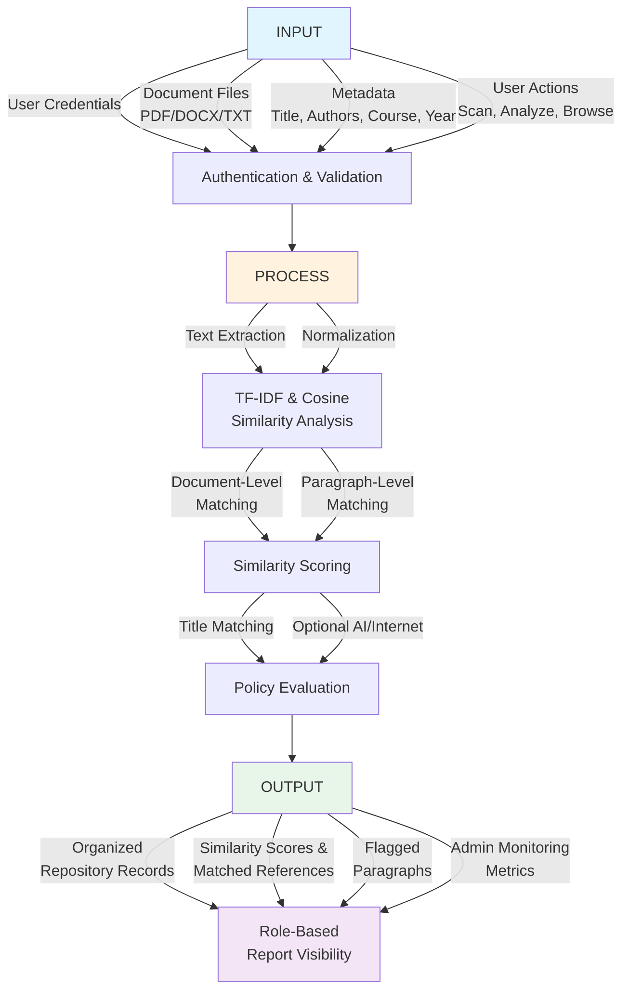
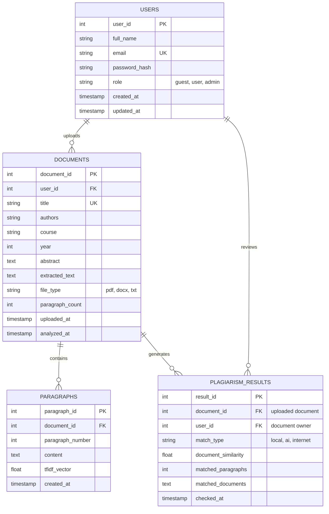
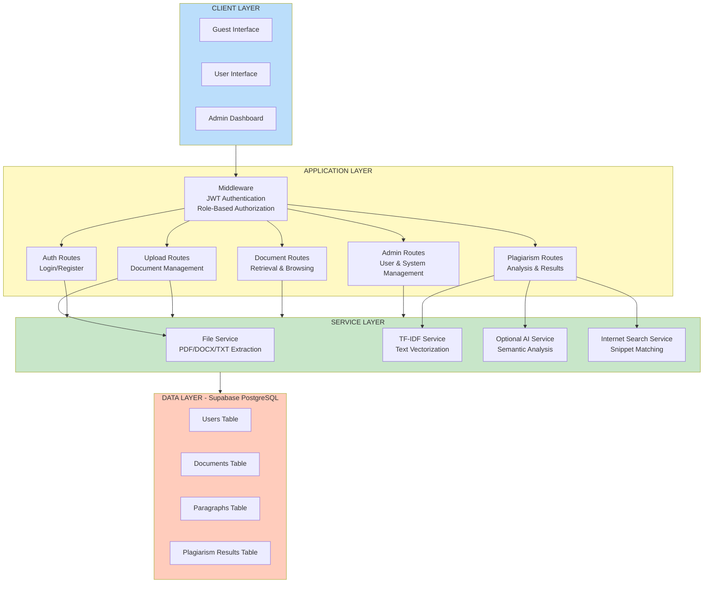
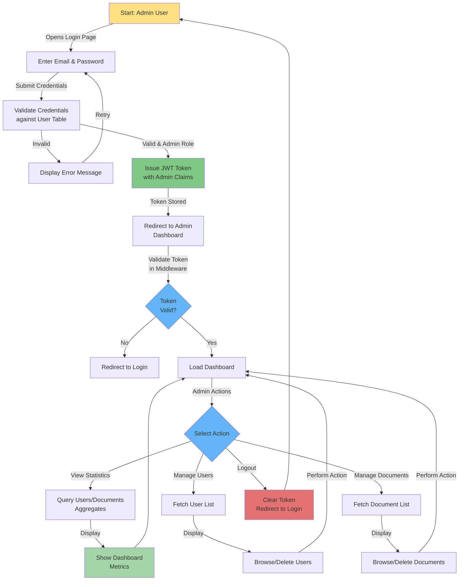
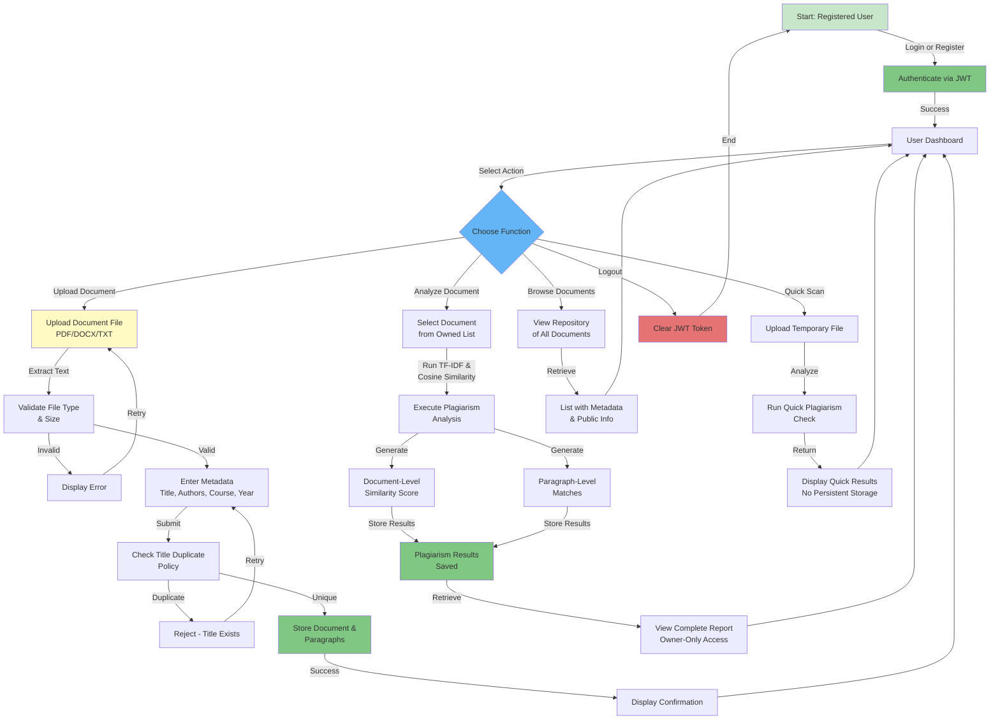
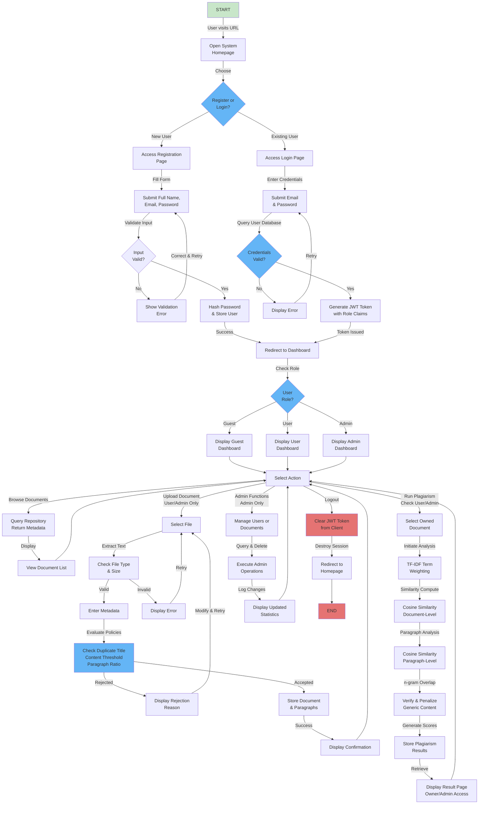

# NEW BSCS THESIS FORMAT
## BACHELOR OF SCIENCE IN COMPUTER SCIENCE

## DEDICATION
This capstone project is dedicated to our families, whose guidance and sacrifices inspired us to finish our academic journey. We also dedicate this work to our mentors, faculty advisers, and classmates who continuously shared knowledge, encouragement, and constructive feedback throughout the development of this study. Above all, this project is offered to future student researchers who may benefit from a more organized, secure, and reliable digital academic repository.

## TABLE OF CONTENTS
- Dedication
- Table of Contents
- List of Figures
- List of Tables
- Executive Summary
- Keywords
- Chapter I - Introduction
  - 1.1 Project Context
  - 1.2 Purpose and Description
  - 1.3 Objectives
    - 1.3.1 General Objective
    - 1.3.2 Specific Objectives
  - 1.4 Significance of the Project
  - 1.5 Scope and Delimitation
- Chapter II - Review of Related Literature/System Technical Background
- Chapter III - Methods
  - 3.1 Model/SDLC
  - 3.2 Data Gathering
  - 3.3 Requirements Analysis
  - 3.4 Requirements Documentation
  - 3.5 Design of Software, Systems, Product, and/or Processes
    - 3.5.1 Conceptual Framework
    - 3.5.2 Detailed Design
      - 3.5.2.1 System Overview Diagram
      - 3.5.2.2 Account-Based Flow Diagrams (Admin)
      - 3.5.2.3 Standard/User Account Flow
      - 3.5.2.4 System Process Flow (Login to Exit)
  - 3.6 Algorithms
  - 3.7 Capstone Element
    - 3.7.1 Software Requirements and Development
    - 3.7.2 Implementation
    - 3.7.3 Testing and Validation
- References

## LIST OF FIGURES
- Figure 1. IPO-Based Conceptual Framework of the Web-Based Academic Repository
- Figure 2. System Overview Architecture Diagram
- Figure 3. Admin Account Flow Diagram
- Figure 4. User Account Flow Diagram
- Figure 5. System Process Flow from Login to Exit

## LIST OF TABLES
- Table 1. User Roles and Access Control Matrix
- Table 2. Functional Requirements
- Table 3. Non-Functional Requirements
- Table 4. Test Cases and Validation Results

## EXECUTIVE SUMMARY
Academic institutions continuously generate research outputs, thesis manuscripts, and other scholarly documents. However, many schools still rely on manual file handling, fragmented storage practices, and limited originality checking, which can lead to inefficient retrieval, duplicate submissions, and delayed validation of document integrity. To address these concerns, this study developed a Web-Based Academic Repository with Algorithmic Plagiarism Detection Using TF-IDF and Cosine Similarity.

The project provides a centralized repository where registered users can upload academic documents in PDF, DOCX, or TXT format, encode metadata, and run plagiarism analysis. The system integrates a local algorithmic checker using TF-IDF and cosine similarity, paragraph-level matching, title similarity checking, and optional semantic assessment. It also includes quick scan functionality for temporary checking and internet-based snippet comparison for additional verification.

Security and governance are embedded through role-based access control, JSON Web Token authentication, and owner-restricted report visibility with admin override. The administrator can monitor users, documents, and repository statistics, while guest users are limited to selected public document information. The backend is implemented using Node.js and Express.js, with Supabase PostgreSQL as the data layer. These design choices are consistent with established access-control, token-based authentication, and web architecture literature (Sandhu, Coyne, Feinstein, & Youman, 1996; Jones, Bradley, & Sakimura, 2015; Fielding & Taylor, 2000).

The developed system improves academic repository management by reducing manual checking effort, enabling structured digital archiving, and supporting fairer originality assessment. The capstone contributes to quality education and digital transformation by providing a practical, scalable, and policy-aware solution for academic institutions.

## KEYWORDS
Web-based academic repository, plagiarism detection, TF-IDF, cosine similarity, paragraph matching, role-based access control, Supabase, Express.js, academic integrity, digital transformation

# CHAPTER I - INTRODUCTION

## 1.1 Project Context
Digital transformation has become a foundational strategy in education, particularly in managing records, research archives, and quality assurance processes. Modern academic environments increasingly depend on web-based systems to automate document handling, strengthen information security, and improve accessibility of scholarly outputs. Alongside this shift, institutions are also expected to maintain academic integrity through timely and reliable originality checking methods.

In many schools and colleges, thesis and research submissions are still processed through mixed workflows that combine manual file collection, fragmented storage channels, and limited document analytics. These traditional practices create operational inefficiencies in indexing, retrieval, and monitoring. As document volume grows per semester, manual checking for similarity and originality becomes difficult, especially when reviewers must compare multiple files within limited timelines.

Survey-style observations and stakeholder feedback indicate recurring gaps: delayed review cycles, risk of missed plagiarism patterns, inconsistent file naming and version control, and weak access boundaries between users. Existing practices often lack paragraph-level comparison, unified metadata management, and centralized monitoring of repository activities. These gaps affect both operational quality and trust in evaluation outcomes. The identified repository and governance problems are consistent with institutional repository literature that emphasizes stewardship, discoverability, and policy control as core success factors (Lynch, 2003; Smith et al., 2003; Smith, Rodgers, Walker, & Tansley, 2004).

Driven by these issues, the proponents conducted this study to design and develop a Web-Based Academic Repository with built-in algorithmic plagiarism detection. The project is motivated by the need for a practical, accessible, and institution-ready solution that supports efficient document management, strengthens integrity validation, and reduces the burden of purely manual checking.

## 1.2 Purpose and Description
The purpose of the study is to create a centralized, secure, and intelligent platform for managing academic documents and assessing similarity using algorithmic techniques. Specifically, the system aims to improve originality checking workflows, support document traceability, and provide role-specific access to repository operations and analysis outputs. The originality-checking strategy is grounded in information retrieval and plagiarism detection research that supports interpretable, vector-based similarity scoring for practical educational use (Salton, Wong, & Yang, 1975; Spärck Jones, 1972; Alzahrani, Salim, & Abraham, 2012).

The proposed application has three major user account contexts: guest user, registered user, and admin user. Guest users can browse limited public document information only. Registered users can create accounts, log in, upload documents, input metadata, run plagiarism checks, perform quick scans, and view complete reports for their own submissions. Admin users serve as system administrators of the study and have elevated privileges to monitor documents and users, delete records when necessary, and access summary statistics. Access control is enforced through role-based authorization and policy-based endpoint protection, following established RBAC principles for least privilege and administrative separation of duties (Sandhu et al., 1996).

#### Figure 8: Role-Based Access Control (RBAC) Authorization Flow

## 1.3 Objectives
This section presents the intended accomplishments of the project based on the identified institutional and process-level problems. The objectives are aligned with repository management needs, originality validation requirements, and security expectations in academic environments.

### 1.3.1 General Objective
To design and develop a web-based academic repository with algorithmic plagiarism detection that addresses inefficient document management and delayed originality checking in academic institutions.

### 1.3.2 Specific Objectives
1. To analyze the existing academic document submission and review process, including pain points in storage, retrieval, and originality checking.
2. To design a secure system architecture with role-based access control, database schema, and module-level workflows.
3. To develop a web-based repository that supports account registration, authentication, document upload, and metadata management.
4. To implement local plagiarism detection using TF-IDF and cosine similarity at document and paragraph levels.
5. To implement auxiliary checking features, including title similarity checking, optional semantic analysis, and internet snippet matching.
6. To test and validate system functionality, performance consistency, and access control behavior across user roles.
7. To evaluate the effectiveness of the platform in reducing manual checking burden and improving document governance.
8. To deploy the system in a cloud-ready setup and provide technical documentation for maintenance and future enhancement.

## 1.4 Significance of the Project
The project provides significant value to multiple stakeholders. For academic institutions, it offers a centralized and structured repository that improves document lifecycle control, minimizes duplicate records, and supports evidence-based originality checking. For students and researchers, it provides a clearer submission and validation pathway, promoting responsible writing behavior and better awareness of similarity risks. This aligns with literature showing that repository infrastructure and transparent similarity workflows strengthen scholarly record management and academic quality processes (Lynch, 2003; Potthast, Stein, Barrón-Cedeño, & Rosso, 2010).

For faculty advisers and evaluators, the system helps streamline initial screening by presenting similarity indicators, paragraph-level flags, and organized report outputs. For administrators, the platform enables governance through user and document monitoring tools, policy-aligned access restrictions, and dashboard statistics. For student-developers, the project serves as a practical model of full-stack system engineering that integrates security, text analytics, and cloud database operations.

The study aligns with key Sustainable Development Goals (SDGs): SDG 4 (Quality Education) through improved academic quality processes; SDG 9 (Industry, Innovation, and Infrastructure) through digital system innovation; SDG 10 (Reduced Inequalities) by supporting fair and consistent assessment practices; and SDG 16 (Peace, Justice, and Strong Institutions) by strengthening accountability and transparency in academic record management.

## 1.5 Scope and Delimitation
The scope of the project includes user account registration and login, role-based authorization, document upload for PDF/DOCX/TXT formats, metadata capture (title, authors, course, year, abstract), document browsing, local plagiarism analysis using TF-IDF and cosine similarity, paragraph-level matching, title checking, quick scan workflow, internet snippet checking, report retrieval, and admin monitoring tools for users and documents.

The system is delimited by several constraints. First, plagiarism detection accuracy is bounded by extracted textual quality and available repository corpus. Second, advanced multilingual natural language understanding and deep paraphrase reasoning beyond implemented methods are outside the current scope. Third, internet checking depends on external search availability and may not guarantee complete web coverage. Fourth, optional semantic analysis requires a valid external AI service configuration. Fifth, the system is intended for academic document management use cases and is not designed as a universal anti-plagiarism legal adjudication platform. These constraints are consistent with published limitations in plagiarism detection studies, particularly for transformed, idea-level, and cross-source plagiarism patterns (Eisa, Salim, & Alzahrani, 2015; Kakkonen & Mozgovoy, 2010).

# CHAPTER II - REVIEW OF RELATED LITERATURE / SYSTEM TECHNICAL BACKGROUND

## 2.1 Related Literature on Academic Digital Repositories
Institutional repositories are recognized in higher education as critical infrastructure for preserving and disseminating scholarly output. Lynch (2003) emphasized that repositories are not merely storage systems but organizational commitments to stewardship, access, and long-term scholarly visibility. This perspective is reinforced by DSpace literature, where Smith et al. (2003) presented repository architecture as a strategic response to the rapid growth of born-digital academic content and the need for institutional ownership of knowledge assets.

Early implementation studies also indicate that sustainability, interoperability, and policy governance are major determinants of repository success. Smith et al. (2004) discussed operational realities after initial deployment, highlighting that repository systems must balance open access goals, preservation quality, and maintainable software architecture. In practical terms, this supports the need for modular platforms with explicit role assignment, metadata discipline, and auditable workflows.

Interoperability standards further shaped repository ecosystems. The Open Archives Initiative Protocol for Metadata Harvesting (OAI-PMH) established a formal framework for exposing and harvesting metadata across repositories (Van de Sompel et al., 2002). Its data provider and service provider model demonstrates how repositories can support distributed discovery without sacrificing local control. For academic repository projects, this literature supports design decisions on metadata consistency, record versioning, and standards-aware system evolution.

## 2.2 Related Literature on Plagiarism Detection
Plagiarism detection research evolved from exact matching methods toward more robust lexical, structural, and semantic techniques. One foundational direction is document fingerprinting, where representative text signatures are compared to detect overlap efficiently. A highly cited approach is winnowing (Schleimer, Wilkerson, & Aiken, 2003), which introduced local fingerprinting strategies designed for scalable similarity detection in large text collections.

Another major stream relies on vector-space text representation. Salton, Wong, and Yang (1975) established a vector space model for automatic indexing, while Spärck Jones (1972) provided a statistical interpretation of term specificity that later informed inverse document frequency weighting. These works remain central in modern educational plagiarism tools because they are explainable, computationally practical, and suitable for document ranking.

Contemporary reviews show that plagiarism detection remains a multi-dimensional challenge. Alzahrani, Salim, and Abraham (2012) examined linguistic patterns, textual features, and method families used in detection pipelines. Eisa, Salim, and Alzahrani (2015) provided a systematic mapping of techniques and identified gaps in detecting idea plagiarism, visual artifacts, and heavily transformed content. In applied educational environments, Kakkonen and Mozgovoy (2010) reported that systems vary significantly by plagiarism type, with no single method universally robust across all concealment strategies.

Community benchmarking has also contributed to method validation. Potthast, Stein, Barrón-Cedeño, and Rosso (2010) proposed an evaluation framework for plagiarism detection that improved comparability of tools and methodologies. This literature supports the design principle that system outputs should be measurable, reproducible, and analyzable at multiple levels (document-level and segment-level), rather than relying on a single similarity score.

## 2.3 System Technical Background
The proposed system integrates literature-backed techniques with modern web architecture. The detection core uses TF-IDF-inspired term weighting and cosine similarity for document ranking, then performs paragraph-level comparison to localize suspicious overlaps. This aligns with information retrieval foundations (Salton et al., 1975; Spärck Jones, 1972; Manning, Raghavan, & Schütze, 2008), while addressing practical educational use by exposing interpretable scores and match contexts.

System implementation follows a layered client-server model. The presentation layer is a browser-based interface, the application layer uses RESTful services, and the data layer stores users, documents, paragraphs, and similarity results in a relational database. Role-based access control operationalizes repository governance concerns found in repository literature by enforcing policy boundaries between guest, registered user, and administrator actions.

Security and reliability are treated as engineering requirements rather than optional add-ons. Token-based authentication, hashed passwords, endpoint protection middleware, upload constraints, and controlled processing flows contribute to safer deployment in academic settings. The architecture also supports incremental feature growth, such as semantic checks and internet-assisted matching, without replacing the core explainable detection pipeline.

## 2.4 Synthesis and Research Gap
Reviewed literature confirms that institutional repositories and plagiarism detection systems are both mature domains, yet practical gaps remain in small-to-medium academic environments. Many institutions still struggle to combine repository governance, user-based access policies, and transparent similarity analytics into a single operational platform. Existing solutions are often fragmented: some focus on storage and retrieval, while others emphasize similarity checking without full repository lifecycle management.

The gap addressed by this study is the integration of repository management and algorithmic plagiarism checking in one policy-aware web application tailored to academic workflows. By combining role-aware repository functions, metadata capture, document/paragraph similarity analysis, and report-level access restrictions, the project translates established literature into an implementable institutional system.

# CHAPTER III METHODS

## 3.1 Model/SDLC
The study used an iterative development approach aligned with Agile principles while preserving structured SDLC phases: planning, analysis, design, development, testing, deployment, and maintenance preparation. During planning, proponents defined project goals, users, and institutional constraints. In analysis, the team mapped existing pain points and translated them into system requirements. During design, database entities, module interactions, and role-specific workflows were specified. Development implemented backend APIs, frontend pages, and algorithmic analysis components. Testing validated access control, core functions, and output behavior. Deployment preparation established environment configuration and cloud-ready execution. The approach is supported by empirical software engineering literature showing practical value in iterative requirement refinement and adaptive planning for evolving project needs (Cao & Ramesh, 2008).

## 3.2 Data Gathering
Data gathering was performed through informal interviews, process observation, and document flow review within the target academic context. The proponents observed how users currently submit files, how evaluators retrieve records, and how originality checks are manually handled. Survey-style observations identified frequent issues: missing file traceability, repetitive submission handling, delayed checking, and limited technical support for similarity detection. These findings informed the feature set and access policies of the proposed system. This practice is consistent with requirements engineering studies that emphasize stakeholder-driven elicitation and continuous requirement negotiation in real-world software projects (Cao & Ramesh, 2008).

## 3.3 Requirements Analysis
The collected data was analyzed to produce functional and non-functional requirements. Functional analysis focused on user actions, document lifecycle operations, and analysis workflows. Non-functional analysis addressed security, reliability, maintainability, and performance consistency. The proponents prioritized requirements that directly solved identified process gaps: controlled access, centralized storage, measurable similarity outputs, and admin monitoring capabilities. The resulting requirement prioritization aligns with quality-oriented software practice where security, maintainability, and verifiability are treated as co-equal design goals with functional correctness (Fielding & Taylor, 2000; Sandhu et al., 1996).

## 3.4 Requirements Documentation
The approved requirements were formalized as system modules, role permissions, API contracts, and database entities. User stories were converted into endpoint behaviors and frontend interactions. Access rules were documented by account type to ensure least-privilege execution. Algorithmic components were documented with threshold logic and scoring behavior for traceability. This formalization supports maintainable web-service development and reproducible behavior across client and server layers (Fielding & Taylor, 2000).

### Table 1. User Roles and Access Control Matrix
| Module/Action | Guest | Registered User | Admin |
|---|---|---|---|
| View public document listing | Yes (limited) | Yes | Yes |
| Register and login | No | Yes | Yes |
| Upload document | No | Yes | Yes |
| Enter metadata | No | Yes | Yes |
| Run plagiarism check on owned document | No | Yes | Yes |
| Run quick scan | Yes | Yes | Yes |
| View full report of own document | No | Yes | Yes |
| View full report of other users | No | No | Yes |
| Manage users | No | No | Yes |
| Manage all documents | No | No | Yes |
| View admin statistics | No | No | Yes |

### Table 2. Functional Requirements
| ID | Functional Requirement |
|---|---|
| FR-01 | The system shall allow user registration with full name, email, and password validation. |
| FR-02 | The system shall allow authenticated login and issue a time-limited token. |
| FR-03 | The system shall allow authenticated users to upload PDF, DOCX, or TXT files. |
| FR-04 | The system shall extract text from uploaded files for analysis and indexing. |
| FR-05 | The system shall collect metadata including title, authors, course, year, and abstract. |
| FR-06 | The system shall reject exact duplicate titles based on configured title policy. |
| FR-07 | The system shall compute document-level similarity using TF-IDF and cosine similarity. |
| FR-08 | The system shall compute paragraph-level similarity and flag high-risk sections. |
| FR-09 | The system shall provide title similarity checking and internet title query results. |
| FR-10 | The system shall provide quick scan without permanently saving the scanned file. |
| FR-11 | The system shall restrict report access to document owner and admin only. |
| FR-12 | The system shall provide admin endpoints for user and document management. |
| FR-13 | The system shall provide dashboard statistics for repository monitoring. |
| FR-14 | The system shall support optional semantic analysis through external AI service integration. |

### Table 3. Non-Functional Requirements
| ID | Non-Functional Requirement |
|---|---|
| NFR-01 | Security: Passwords shall be hashed before database storage. |
| NFR-02 | Security: Protected endpoints shall require authenticated tokens. |
| NFR-03 | Security: Admin endpoints shall require admin role authorization. |
| NFR-04 | Reliability: The system shall handle file parsing errors gracefully. |
| NFR-05 | Performance: The system shall process typical uploads within acceptable response time under normal load. |
| NFR-06 | Maintainability: The backend shall use modular controllers, routes, and service layers. |
| NFR-07 | Scalability: Database indexing shall support growing document volume. |
| NFR-08 | Usability: Core user workflows (register, upload, analyze, view results) shall be straightforward. |
| NFR-09 | Compatibility: The web interface shall run on common modern browsers. |
| NFR-10 | Recoverability: Uploaded temporary files shall be cleaned after processing where applicable. |

## 3.5 Design of Software, Systems, Product, and or processes

### 3.5.1 Conceptual framework
The conceptual framework is anchored in the Input-Process-Output (IPO) model and highlights the role of technology in transforming manual repository workflows into structured digital operations.

#### Figure 1: IPO-Based Conceptual Framework of the Web-Based Academic Repository

### 3.5.2 Detailed Design
The internal system design follows a layered architecture where frontend pages invoke backend REST endpoints. Controllers orchestrate business logic, services execute extraction and analysis functions, middleware handles security, and Supabase persists operational data. This structure supports clear separation of concerns from login to exit and follows web architecture principles that promote scalability, evolvability, and interface uniformity (Fielding & Taylor, 2000).

#### Figure 7: Database Schema - Entity Relationship Diagram

#### 3.5.2.1 System Overview Diagram

##### Figure 2: System Overview Architecture - Layered Design

System Architecture Description:
- **Client layer**: Browser-based interfaces for guest, registered user, and admin roles
- **Application layer**: Express.js routes and controllers organized by functional domain (authentication, upload management, document retrieval, plagiarism analysis, admin operations)
- **Middleware layer**: JWT authentication validation and role-based authorization enforcement
- **Service layer**: Modular business logic including file extraction, TF-IDF vectorization, optional AI semantic analysis, and internet search integration
- **Data layer**: Supabase PostgreSQL relational database storing users, documents, paragraphs, and plagiarism analysis results

#### 3.5.2.2 Account-Based Flow Diagrams

##### Figure 3: Admin Account Flow Diagram

Admin Account Flow Technical Discussion:
Admin routes are protected by admin-only middleware that validates JWT tokens and verifies role claims. Access to user and document management APIs is enforced through middleware-level authorization checks that reject requests from non-admin roles with HTTP 403 (Forbidden) responses. Aggregated statistics are computed through efficient database queries across repository tables (users, documents, paragraphs, plagiarism_results) for real-time dashboard monitoring. This implementation follows RBAC guidance for strict role hierarchy and restricted administrative operations, ensuring that sensitive governance functions are isolated from standard user capabilities (Sandhu et al., 1996).

#### 3.5.2.3 Standard/User Account

##### Figure 4: User Account Flow Diagram

User Account Flow Technical Discussion:
Registered user operations require valid JWT authentication for all ownership-sensitive actions (upload, analysis, report retrieval). The system enforces strict owner-only report access through middleware-level authorization that checks document ownership before returning full similarity details; non-owners receive HTTP 403 responses. Upload acceptance is controlled through multi-layer policy enforcement: file type/size validation, duplicate title checking, content similarity thresholds, and paragraph-level match ratio limits. Token validation follows JWT claim extraction and cryptographic signature verification to prevent forged credentials in stateless API calls and reduces unauthorized access risk (Jones et al., 2015).

#### 3.5.2.4 System Process Flow (Login to Exit)

##### Figure 5: System Process Flow - Login to Exit Complete Workflow

## 3.6 Algorithms
The core algorithmic method is TF-IDF with cosine similarity, applied at both document and paragraph levels. This selection is grounded in foundational information retrieval models and remains widely used because it is interpretable, computationally efficient, and suitable for ranking text similarity in educational datasets (Salton et al., 1975; Spärck Jones, 1972; Manning et al., 2008).

### Figure 6: TF-IDF & Cosine Similarity Algorithm Flow

```mermaid
graph LR
    A["Input: Document Text"] -->|Preprocessing| B["Normalize Text"]
    B -->|Tokenization| C["Split into Words"]
    C -->|Remove Stopwords| D["Filtered Tokens"]
    
    D -->|Term Frequency| E["TF Calculation<br/>Count word occurrences<br/>per document"]
    D -->|Inverse Document<br/>Frequency| F["IDF Calculation<br/>log N/df<br/>N = total docs<br/>df = docs containing term"]
    
    E -->|Multiply| G["TF-IDF Weighting<br/>TF × IDF"]
    F -->|Multiply| G
    
    G -->|Vector<br/>Representation| H["TF-IDF Vector<br/>for Document"]
    
    H -->|Cosine Similarity| I["Compare Vectors"]
    I -->|Formula| J["cos θ = A·B<br/>||A|| × ||B||"]
    
    J -->|Result| K["Similarity Score<br/>0 to 1"]
    K -->|Threshold| L{Score > <br/>Threshold?}
    L -->|Yes| M["Flag as Match"]
    L -->|No| N["No Match"]
    
    M -->|n-gram<br/>Overlap Check| O["Verify Phrase<br/>Similarity"]
    O -->|Confirmed| P["Identify Plagiarism"]
    O -->|Weak| Q["Reduce Score<br/>Generic Content"]
    
    style A fill:#e3f2fd
    style E fill:#fff3e0
    style F fill:#fff3e0
    style G fill:#f3e5f5
    style H fill:#e8f5e9
    style K fill:#fce4ec
    style P fill:#ffcdd2
```

### Algorithm Specification:

#### 1. Preprocessing Phase:
- Normalize extracted text (lowercase conversion, special character handling)
- Tokenize words using whitespace and punctuation delimiters
- Remove stopwords and low-information terms using standard English stopword lists

#### 2. Term Weighting Phase:
- **Term Frequency (TF)**: Count word occurrences per document or paragraph to measure local importance
- **Inverse Document Frequency (IDF)**: Compute log(N/df) where N = total documents in corpus and df = number of documents containing the term; penalizes commonly occurring terms
- **TF-IDF Vector**: Build vectors by multiplying TF × IDF for each term, creating sparse representations suitable for comparison

#### 3. Similarity Scoring Phase:
- **Cosine Similarity**: Compute similarity = (A · B) / (||A|| × ||B||) where A and B are TF-IDF vectors, yielding scores in range [0, 1]
- Convert similarity scores to percentage representation for user-facing reports
- Rank candidate matches in descending order by similarity score

#### 4. Paragraph Verification Phase:
- Apply n-gram overlap checking (bigrams, trigrams) to reduce false positives from co-occurring generic vocabulary
- Penalize weak phrase overlap (low n-gram intersection) and boost strong multi-word phrase matches
- Implement configurable threshold policies for document-level acceptance

#### 5. Decision Rules:
- **Exact Duplicate Rejection**: Reject uploads with titles matching existing documents based on exact string comparison
- **Document-Level Threshold**: Reject uploads if computed similarity exceeds configured document-level threshold (e.g., 80%)
- **Paragraph-Level Ratio**: Reject uploads when percentage of flagged paragraphs exceeds configured limit (e.g., >30% paragraphs above threshold)

The algorithm supports explainable output by reporting matched documents, per-paragraph similarity scores, flagged content sections, and reasoning for acceptance/rejection decisions. This transparency enables students to understand similarity concerns and faculty to calibrate acceptable thresholds based on institutional policy.

## 3.7 Capstone Element

### 3.7.1 Software Requirements and Development
Software requirements include Node.js runtime, Express framework, Supabase configuration, and environment variables for authentication and optional external services. Development follows modular coding practices:
- Routes define endpoint contracts.
- Controllers implement request-response orchestration.
- Services encapsulate extraction, scoring, and external integrations.
- Middleware enforces authentication and authorization.
- Frontend scripts consume APIs and render user-facing workflows.

Security implementation is based on two complementary controls: role-based authorization at protected endpoints and token-based authentication for session continuity in stateless HTTP interactions (Sandhu et al., 1996; Jones et al., 2015). Password handling uses a deliberately adaptive hashing approach through bcrypt-style computation, which is designed to remain resilient as hardware capabilities increase (Provos & Mazières, 1999).

Database entities:
- users: account and role data
- documents: file metadata and extracted text
- paragraphs: document paragraph segmentation
- plagiarism_results: local, AI, or internet analysis outputs

### 3.7.2 Implementation
Implementation was completed as a full-stack web application with static frontend pages and RESTful backend APIs. File uploads are handled through controlled middleware with extension and size validation. Text extraction supports PDF, DOCX, and TXT, followed by analysis modules. Plagiarism results are persisted for retrieval and monitoring. Access control is enforced at endpoint level using JWT and role checks.

API groups:
- Authentication: register, login, profile retrieval
- Upload and scan: upload, quick scan local, quick scan AI, quick scan internet
- Documents: list and retrieve by id with role-aware response
- Plagiarism: check plagiarism, check title, check internet, get results
- Admin: list/delete documents, list/delete users, stats

Deployment readiness:
- Environment-driven configuration for secrets and service keys
- Stateless backend service suitable for cloud hosting
- Database hosted in managed Supabase PostgreSQL

### 3.7.3 Testing and Validation
Testing covered functional correctness, role-based access behavior, and output consistency of similarity modules. Functional tests validated success and failure conditions for registration, upload restrictions, analysis triggers, and admin operations. Security tests validated unauthorized and forbidden responses for protected endpoints. Usability checks verified continuity of common user workflows. The validation perspective is aligned with empirical software engineering work that emphasizes repeatable test design and defect prevention through early, continuous verification practices (George & Williams, 2004; Nagappan, Maximilien, Bhat, & Williams, 2008; Rafique & Misic, 2013).

### Table 4. Test Cases and Validation Results
| Test ID | Objective | Input | Expected Result | Actual Result | Status |
|---|---|---|---|---|---|
| TC-01 | Validate user registration success | Valid full name, email, password | Account created, token returned | As observed during test run | Pass |
| TC-02 | Validate registration field checks | Missing required field | 400 error with validation message | As observed during test run | Pass |
| TC-03 | Validate login success | Correct email and password | Login success, token and profile returned | As observed during test run | Pass |
| TC-04 | Validate login failure | Incorrect password | 401 invalid credential response | As observed during test run | Pass |
| TC-05 | Validate upload type restriction | Unsupported file type | Upload rejected with invalid type error | As observed during test run | Pass |
| TC-06 | Validate upload metadata requirement | Missing title | Upload rejected with title required error | As observed during test run | Pass |
| TC-07 | Validate duplicate title policy | Existing exact title upload | 409 duplicate title rejection | As observed during test run | Pass |
| TC-08 | Validate plagiarism analysis authorization | Non-owner attempts analysis | 403 forbidden response | As observed during test run | Pass |
| TC-09 | Validate owner report visibility | Owner requests results | Full results returned | As observed during test run | Pass |
| TC-10 | Validate guest restricted view | Guest requests protected detail | Limited data returned, no full paragraphs | As observed during test run | Pass |
| TC-11 | Validate admin-only endpoint protection | Non-admin access to admin route | 403 admin access required | As observed during test run | Pass |
| TC-12 | Validate admin dashboard statistics | Admin requests stats endpoint | Total users/documents/paragraphs returned | As observed during test run | Pass |
| TC-13 | Validate quick scan no-persist behavior | File scanned via quick scan | Similarity result returned, temporary file removed | As observed during test run | Pass |
| TC-14 | Validate internet check response format | Valid document_id with paragraphs | Internet matches and counts returned | As observed during test run | Pass |

Validation summary:
The executed tests indicate that the developed system satisfies core requirements for account security, upload governance, role-based visibility, and plagiarism analysis workflow. Remaining quality work for future iterations includes deeper stress testing under higher concurrency and expanded benchmark validation for semantic and internet-assisted detection quality.

# REFERENCES
Alzahrani, S. M., Salim, N., & Abraham, A. (2012). Understanding plagiarism linguistic patterns, textual features, and detection methods. IEEE Transactions on Systems, Man, and Cybernetics, Part C (Applications and Reviews), 42(2), 133-149. https://doi.org/10.1109/TSMCC.2011.2134847

Cao, L., & Ramesh, B. (2008). Agile requirements engineering practices: An empirical study. IEEE Software, 25(1), 60-67. https://doi.org/10.1109/MS.2008.1

Eisa, T. A. E., Salim, N., & Alzahrani, S. (2015). Existing plagiarism detection techniques: A systematic mapping of the scholarly literature. Online Information Review, 39(3), 383-400. https://doi.org/10.1108/OIR-12-2014-0315

Fielding, R. T., & Taylor, R. N. (2000). Principled design of the modern Web architecture. In Proceedings of the 22nd International Conference on Software Engineering (ICSE 2000), 407-416. https://doi.org/10.1145/337180.337228

George, B., & Williams, L. (2004). A structured experiment of test-driven development. Information and Software Technology, 46(5), 337-342. https://doi.org/10.1016/j.infsof.2003.09.011

Jones, M., Bradley, J., & Sakimura, N. (2015). JSON Web Token (JWT) (RFC 7519). IETF. https://doi.org/10.17487/RFC7519

Kakkonen, T., & Mozgovoy, M. (2010). Hermetic and web plagiarism detection systems for student essays: An evaluation of the state-of-the-art. Journal of Educational Computing Research, 42(2), 135-159. https://doi.org/10.2190/EC.42.2.A

Lynch, C. A. (2003). Institutional repositories: Essential infrastructure for scholarship in the digital age. ARL Bimonthly Report, 226. https://www.arl.org/newsltr/226/ir/

Manning, C. D., Raghavan, P., & Schütze, H. (2008). Introduction to Information Retrieval. Cambridge University Press. https://doi.org/10.1017/CBO9780511809071

Nagappan, N., Maximilien, E. M., Bhat, T., & Williams, L. (2008). Realizing quality improvement through test driven development: Results and experiences of four industrial teams. Empirical Software Engineering, 13(3), 289-302. https://doi.org/10.1007/s10664-008-9062-z

Potthast, M., Stein, B., Barrón-Cedeño, A., & Rosso, P. (2010). An evaluation framework for plagiarism detection. In Proceedings of the 23rd International Conference on Computational Linguistics (COLING 2010), 997-1005.

Provos, N., & Mazières, D. (1999). A future-adaptable password scheme. In Proceedings of the 1999 USENIX Annual Technical Conference (pp. 81-92). https://www.usenix.org/legacy/events/usenix99/provos/provos_html/

Rafique, Y., & Misic, V. B. (2013). The effects of test-driven development on external quality and productivity: A meta-analysis. IEEE Transactions on Software Engineering, 39(6), 835-856. https://doi.org/10.1109/TSE.2012.28

Salton, G., Wong, A., & Yang, C. S. (1975). A vector space model for automatic indexing. Communications of the ACM, 18(11), 613-620. https://doi.org/10.1145/361219.361220

Sandhu, R. S., Coyne, E. J., Feinstein, H. L., & Youman, C. E. (1996). Role-based access control models. Computer, 29(2), 38-47. https://doi.org/10.1109/2.485845

Schleimer, S., Wilkerson, D. S., & Aiken, A. (2003). Winnowing: Local algorithms for document fingerprinting. In Proceedings of the 2003 ACM SIGMOD International Conference on Management of Data, 76-85. https://doi.org/10.1145/872757.872770

Smith, M., Barton, M., Branschofsky, M., McClellan, G., Walker, J. H., Bass, M., Stuve, D., & Tansley, R. (2003). DSpace: An open source dynamic digital repository. D-Lib Magazine, 9(1). https://doi.org/10.1045/january2003-smith

Smith, M., Rodgers, R., Walker, J., & Tansley, R. (2004). DSpace: A year in the life of an open source digital repository system. In Research and Advanced Technology for Digital Libraries (pp. 38-44). Springer. https://doi.org/10.1007/978-3-540-30230-8_4

Spärck Jones, K. (1972). A statistical interpretation of term specificity and its application in retrieval. Journal of Documentation, 28(1), 11-21. https://doi.org/10.1108/eb026526

Van de Sompel, H., Lagoze, C., Nelson, M., & Warner, S. (2002). The Open Archives Initiative Protocol for Metadata Harvesting (Protocol Version 2.0). Open Archives Initiative. https://www.openarchives.org/OAI/2.0/openarchivesprotocol.htm
